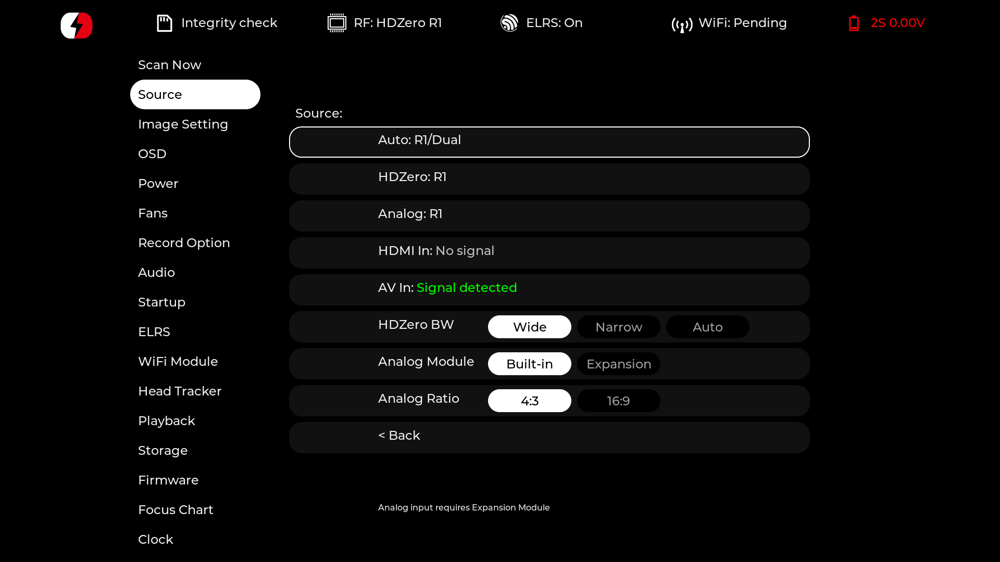
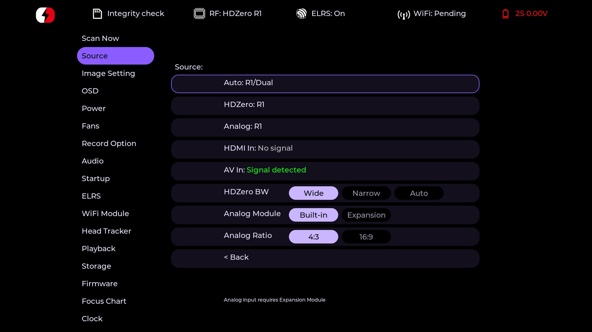
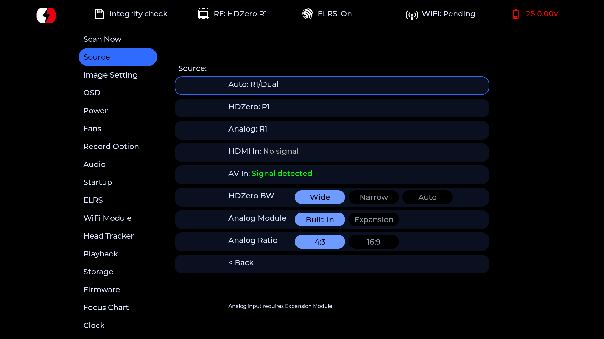
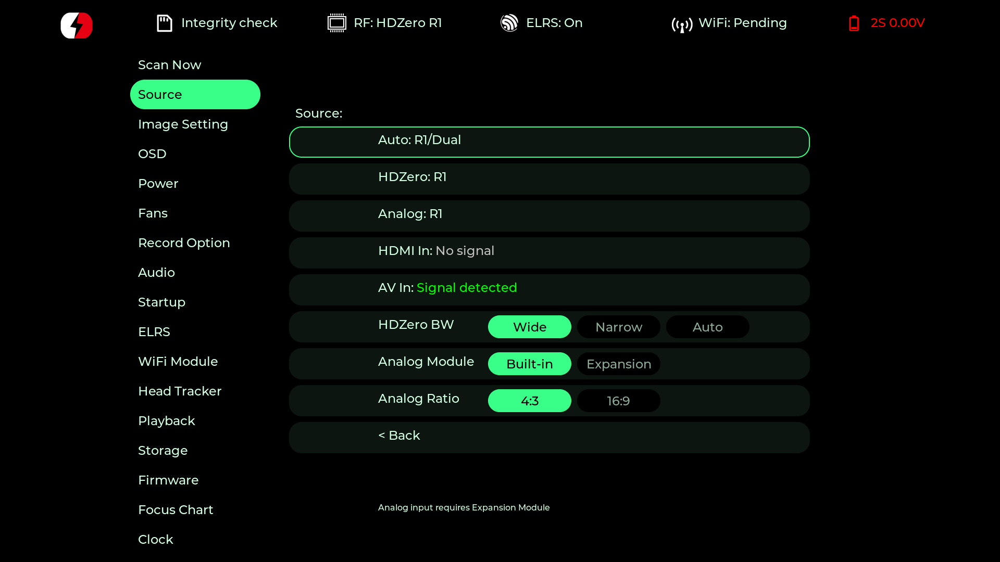

# HDZero Goggles Firmware — graphn build

Private fork of the HDZero goggles firmware (Goggle, Goggle2, BoxPro), built and versioned as `graphn`.

## Changes in this fork

### Startup

The old "Startup Scan" page is now just "Startup", with a clearer 3-step flow:

1. **Scan / Boot / Menu** — run a scan at boot, load a channel directly, or open the menu.
2. **Last / Source** — use whichever channel was last active, or pick one explicitly.
3. **Source select** — only shown when step 2 is "Source": HDZero / Analog / AV In / HDMI In / Auto.

`Menu` opens the menu straight away, landing on the Source page — nothing gets tuned or loaded until you
actually leave the menu (there's a single physical display plane, so loading a channel first would force a
video flash before the menu could appear). `Boot` and `Scan` behave as before, just renamed for clarity.

### ELRS backpack dial control

With the external Expansion analog bay active, the dial now sends channel changes over the ELRS backpack
instead of the internal analog VRX. The current-channel indicator shows the last channel the backpack
reported, rather than the internal VRX's own channel.

### Theme system

13 runtime-selectable UI themes (a new "Theme" page in the menu): the original look, plus 12 dark, pill-style
palettes (Braise, Ambre, Glace, Ultraviolet, Radar, Magenta, Rouge pur, Bordeaux & or, Citron, Bleu électrique,
Sarcelle, Monochrome). The selected theme is applied after restarting the goggles.

| Monochrome | Ultraviolet |
| :---: | :---: |
|  |  |
| **Bleu électrique** | **Radar** |
|  |  |

### Playback

- Clips are sorted by actual recency (file modification time), not filename.
- Marking a clip as a favorite moves it into a `Favorites/` subfolder of the DVR folder instead of renaming
  it in place — plug the card into a computer and favorites are their own folder, easy to find. Clips
  favorited under the old renaming scheme are migrated automatically the first time the page loads.
- A day-history sidebar next to the grid shows a "MM-YY" header per month with the individual days
  underneath, with a cursor tracking whichever clip is currently highlighted.

### Low SD card space alert

A configurable low-space warning (Storage page, "Low Space Alert" slider, 1.0–5.0GB in 500MB steps):

- a beep, once, the moment free space drops below the threshold,
- the status bar's free-space text turns orange,
- a "LOW SD SPACE" OSD banner while watching video — a normal OSD element, so it can be repositioned or
  hidden from OSD → Adjust OSD Elements like any other.

### Firmware update page

A failed update now shows the actual error from the on-device update script (corrupt archive, missing
component, write failure, ...) instead of a bare, uninformative "FAILED".

### UI fixes

Assorted fixes found while building the above: overlapping pills on the Power page, a missing focus outline
on the firmware-update dialog and on Clock's individual date/time fields, a stray divider line between the
sidebar and the page content, and the sidebar tab highlight landing on the wrong entry when a page is opened
programmatically (e.g. Startup="Menu" onto Source).

### Versioning

Version strings use `YY.MM.NN-graphn-<commit>` (year, month, and the number of commits so far this month —
resets on its own at the start of each month) instead of a manually bumped `X.Y.Z`. Tagged releases omit the
commit suffix.

## Environment Setup

The firmware can either be built in a [devcontainer](https://containers.dev/) or natively on a linux machine.

Note: decompressing the repository in Windows system may damage some files and prevent correct builds.

### Devcontainer Setup

This repository supports the [vscode devcontainer](https://code.visualstudio.com/docs/devcontainers/containers) integration.
To get started, install docker, vscode and the devcontainer extension.
A [prompt](https://code.visualstudio.com/docs/devcontainers/create-dev-container#_add-configuration-files-to-a-repository) to reopen this repository in a container should appear.

### Native Setup

CMake is required for generating the build files.
A bash script is supplied to take care of the bootstrap process:

```
~/hdzero-goggle$ ./setup.sh
```

## Building Firmware

In either of the above scenarios the firmware can be built via make.
An appropiate vscode build task ships with this repository as well.

Compiling HDZero Goggles:
```
~/hdzero-goggle$ cd build_goggle
~/hdzero-goggle/build_goggle$ make clean all -j $(nproc)
```

The firmware is generated as hdzero-goggle/build_goggle/out/HDZERO_GOGGLE-77-206-26.09.30-graphn-<commit>.bin
(version = year.month.this-month's-commit-count). Tagged releases omit the commit suffix.

Compiling HDZero BoxPro:
```
~/hdzero-goggle$ cd build_boxpro
~/hdzero-goggle/build_boxpro$ make clean all -j $(nproc)
```

The firmware is generated as hdzero-goggle/build_boxpro/out/HDZERO_BOXPRO-77-211-26.09.30-graphn-<commit>.bin
(version = year.month.this-month's-commit-count). Tagged releases omit the commit suffix.

### Building the firmware using nix

The nix build system can be used to build the firmware on any linux system.  
Make sure that nix [is installed](https://nixos.org/download/), and the [flakes feature](https://wiki.nixos.org/wiki/Flakes) is enabled.  
No bootstrapping or installation of any tools is required.

Use this command to build the firmware

```shellSession
nix build .#goggle-app
```

After this succeeds, the firmware can be found under `./result` in the current directory.


## Loading the Firmware

Firmware can be either flashed via goggle menu or alternatively be executed via the SD Card with a custom development script.  An example of this development script is provided below.  The goggles automatically checks to see if the develop.sh script exists in the root of the SD Card and if found develop.sh is then executed.

The following files must be placed in the root of SD Card in this example. This script will then check to see if HDZGOGGLE binary has been found during bootup and if found then executed.

Otherwise, if the HDZGOOGLE binary is not detected, the goggles will continue to load the built-in executable which was previously flashed.

SD Card File Hierarchy:

```
/develop.sh
/HDZGOGGLE
```

Development script (develop.sh):

```
#!/bin/sh

# Load via SD Card if found
if [ -e /mnt/extsd/HDZGOGGLE ]; then
	/mnt/extsd/HDZGOGGLE &
else
	/mnt/app/app/HDZGOGGLE &
fi
```

## Building the Emulator

Goggle source code can be built natively on the host machine and used for debugging.

### Library required

Requires build-essential tools and SDL2 development libraries (libsdl2-dev for debian) to be already installed.

```
sudo apt-get install build-essential libsdl2-dev
```

### Build and Run

Emulator support for both Goggle and BoxPro is supported by setting the appropriate compilation switches.

```
~/hdzero-goggle$ mkdir build_emu
~/hdzero-goggle$ cd build_emu
~/hdzero-goggle/build_emu$ cmake .. -DEMULATOR_BUILD=ON -DCMAKE_BUILD_TYPE=Debug -DHDZ_GOGGLE=ON -DHDZ_BOXPRO=OFF -DHDZ_GOGGLE2=OFF
~/hdzero-goggle/build_emu$ make -j $(nproc)
~/hdzero-goggle/build_emu$ ./HDZGOGGLE
```

Alternatively, `.devcontainer/emu.sh` wraps the same build inside the devcontainer image and can also grab a
headless screenshot (`emu.sh shot <name>`) without a display attached.

### Emulator Keys

`w` = wheel up
`s` = wheel down
`d` = wheel center press
`l` = right/function button
Use `F11` to toggle full screen where applicable.
