# HDZero Goggles Firmware — graphn build

Private fork of the HDZero goggles firmware (Goggle, Goggle2, BoxPro), built and versioned as `graphn`.

## ⚠️ Disclaimer

This is an unofficial, community build. It is provided **as is, without any warranty**, and it is **not
supported by HDZero**. Flashing it is done entirely **at your own risk**.

- The author of this fork is **in no way responsible** for any **hardware damage** (goggles, battery, SD
  card, antennas, or anything connected to them) or any **software lock-up** (goggles that fail to boot,
  hang on the boot logo, loop, or end up bricked), nor for any data lost (recordings, settings, SD card
  content), or any other loss or consequence resulting from installing or using this firmware, including its
  WiFi Share, web portal and light copy features. You use it entirely at your own risk.
- To go back to the official HDZero firmware if something goes wrong, you may have to reflash the goggles
  with a **Phoenix Card** (HDZero's recovery tool; see
  [Emergency recovery with a PhoenixCard SD card](#emergency-recovery-with-a-phoenixcard-sd-card)). Have one
  available before you experiment, or make sure you are comfortable without your goggles until you get one.
- Don't flash while the battery is low, and never power off or unplug the goggles during an update.

## Changes in this fork

### What each device gets

Compared with the upstream firmware this fork is based on (`LVTY-AI/hdzero-goggle`):

| Addition | Goggle 1 | Goggle 2 | Box Pro |
|---|---|---|---|
| **WiFi Share** (hotspot, share window, power saving) | ✅ | ✅ | ✅ (hidden on a non-Pro Box Pro) |
| **Web portal** (list, thumbnails, favourites, dates, playback, download, MP4) | ✅ | ✅ | ✅ |
| **Light copy** + **Clear Light DVR** (Storage) | ✅ | ✅ | ✅ |
| **Tools** page (Focus Chart, Frequency Chart, Temperature) | ✅ | ✅ | ✅ (1 probe instead of 3) |
| **Frequency Chart** (analog A, B, E, F/I, R and digital D, J, O, Q bands) | ✅ | ✅ | ✅ |
| **RSSI Scanner** + **Scan Page** | — | ✅ | ✅ |
| **Themes** (13) + round colour dots + pill-style menu | ✅ | ✅ | — |
| **VTX control** through the ELRS backpack (sending the channel) | ✅ | ✅ | ✅ |
| **Dial with the Expansion module**: selects the channel and sends it to the VTX, without tuning an internal receiver or interrupting the DVR | ✅ | ✅ | — (tunes its internal receiver) |
| **Playback**: action menu (Favorite, MP4, Remove, Info), sort by date, favourites folder, month history | ✅ | ✅ | ✅ |
| **.ts to .mp4 conversion** (index at the start, `hvc1`) | ✅ | ✅ | ✅ |
| **Startup** in 3 steps (Scan / Boot / Menu) | ✅ | ✅ | ✅ |
| **Low SD space alert** (beep, status bar, OSD banner) | ✅ | ✅ | ✅ |
| **Firmware update page**: the real script error | ✅ | ✅ | ✅ |
| **SD package** (the test WAV moved out of the firmware) | ✅ | ✅ | ✅ |
| **Tools chart images** per platform, lighter PNGs | 1080p | 1080p | 720p |
| **Version** `YY.MM.NN-graphn` | ✅ | ✅ | ✅ |
| UI fixes (Power, Record, Clock, Head Tracker, sidebar) | ✅ | ✅ | ✅ |
| **Tested on real hardware** | no | **yes** | no |

- Only the Goggle 2 has been tested on real hardware, including the portal and the light copy. The Goggle 1
  and the Box Pro were only checked in the emulator, and the Goggle 1's Expansion dial is written but not
  tried.
- On the Box Pro the DVR records at 720p60, so all its clips go through the light copy; this has not been
  tried.
- VTX control needs the backpack described under [ELRS backpack dial control](#elrs-backpack-dial-control).

### Startup

The old "Startup Scan" page is now just "Startup", with a clearer 3-step flow:

1. **Scan / Boot / Menu** — run a scan at boot, load a channel directly, or open the menu.
2. **Last / Source** — use whichever channel was last active, or pick one explicitly.
3. **Source select** — only shown when step 2 is "Source": HDZero / Analog / AV In / HDMI In / Auto.

`Menu` opens the menu straight away, landing on the Source page — nothing gets tuned or loaded until you
actually leave the menu (there's a single physical display plane, so loading a channel first would force a
video flash before the menu could appear). `Boot` and `Scan` behave as before, just renamed for clarity.

### ELRS backpack dial control

With the external Expansion analog module active (Goggle 2, and Goggle 1, which has no built-in analog
receiver: its Analog source is always the Expansion module), the dial now selects a channel and sends it to the VTX
over the ELRS backpack instead of tuning an internal analog VRX. Nothing is tuned on the goggle and the DVR
is not interrupted. The current-channel indicator shows the last channel the backpack reported (or that was
sent), rather than an internal VRX's own channel. The Box Pro, which has a built-in analog receiver, still
tunes it and sends the channel to the VTX.

**VTX control requires this backpack:** to control the VTX from the goggles ("Send VTX"), flash the
**HDZero Goggles Backpack x.x.x-graphn** release of
[FLORIANSV35/Backpack](https://github.com/FLORIANSV35/Backpack/releases) (a fork of the
[ExpressLRS Backpack](https://github.com/ExpressLRS/Backpack)) on the goggles' built-in ESP32 backpack. The
stock ExpressLRS Backpack is not enough for VTX control with this firmware.

- Take the release named **HDZero Goggles Backpack x.x.x-graphn** (currently
  [1.5.9-graphn](https://github.com/FLORIANSV35/Backpack/releases/tag/graphn-hdz-bkpk-1.5.9-graphn)), not the
  *Rapidfire Backpack* one listed next to it, which is for another receiver.
- It ships two files, `hdzero-goggle.vrx.esp32.wifi.bin` (Goggle, Goggle 2) and
  `hdzero-boxpro.vrx.esp32.wifi.bin` (Box Pro). They are identical firmware; flash the one for your goggles
  through the WiFi OTA update.
- It is built **without a binding phrase**: after flashing, bind it yourself, as with any ExpressLRS backpack
  (enter your binding phrase on the backpack's WiFi configuration page, or use the bind button). Until then
  it will not pair with your TX module or goggles.

### Theme system

13 runtime-selectable UI themes (a "Theme" row in the Tools page): the original look, plus 12 dark, pill-style
palettes (Braise, Ambre, Glace, Ultraviolet, Radar, Magenta, Rouge pur, Bordeaux & or, Citron, Bleu électrique,
Sarcelle, Monochrome). The selected theme is applied after restarting the goggles.

| Monochrome | Ultraviolet |
| :---: | :---: |
| 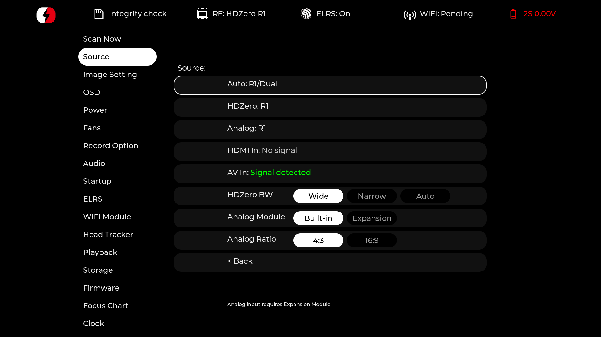 | 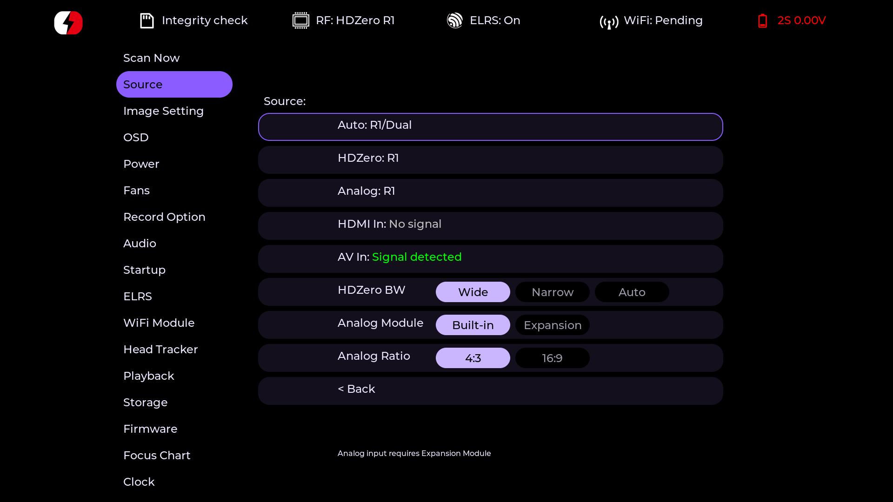 |
| **Bleu électrique** | **Radar** |
| 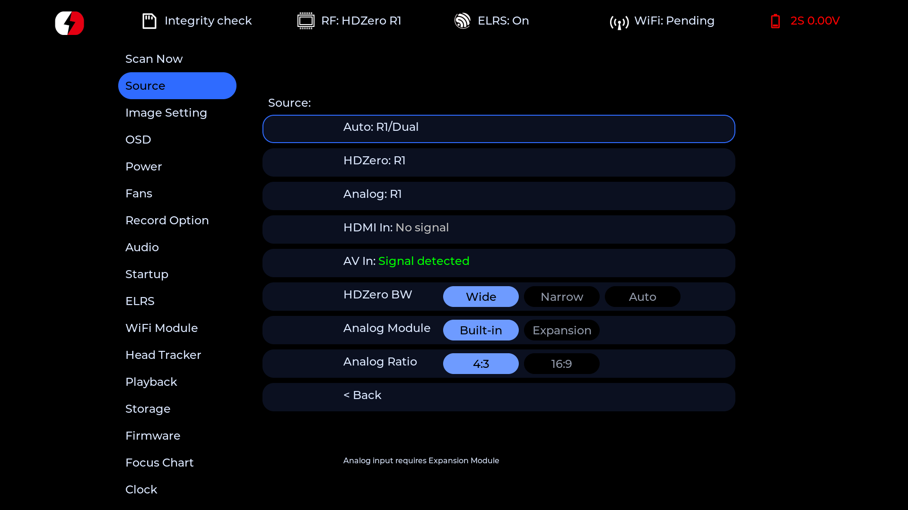 | 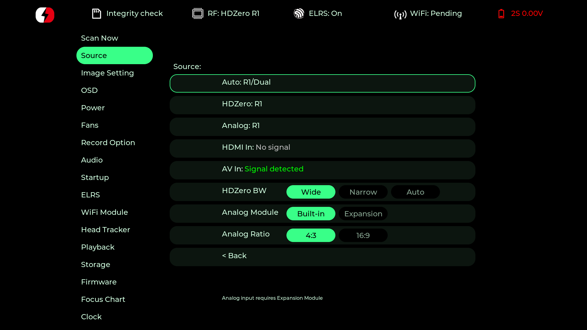 |

### Playback

- Clips are sorted by actual recency (file modification time), not filename.
- Marking a clip as a favorite moves it into a `Favorites/` subfolder of the DVR folder instead of renaming
  it in place — plug the card into a computer and favorites are their own folder, easy to find. Clips
  favorited under the old renaming scheme are migrated automatically the first time the page loads.
- A day-history sidebar next to the grid shows a "MM-YY" header per month with the individual days
  underneath, with a cursor tracking whichever clip is currently highlighted.
- **Long-press the Func (right) button on a clip** to open an action menu: **Favorite / Unfavorite**,
  **Convert to MP4** (only offered for `.ts` clips), **Remove** and **Info**. The old short-press Func
  favorite shortcut is gone; use the menu.
- **Convert to MP4** remuxes the `.ts` into an `.mp4` without re-encoding, so it is fast and lossless. A
  progress bar shows how far along it is, three beeps signal the end, the converted file keeps the original
  recording date, and the selection lands on the new clip. The conversion runs in a separate `ts2mp4`
  process, since ffmpeg is not linked into the main UI binary.
- **Info** shows the clip's date, duration, size, fps, resolution and extension; turn the wheel to close it.
- `.mp4` clips get a small green dot at the bottom-right of their thumbnail in the grid.

[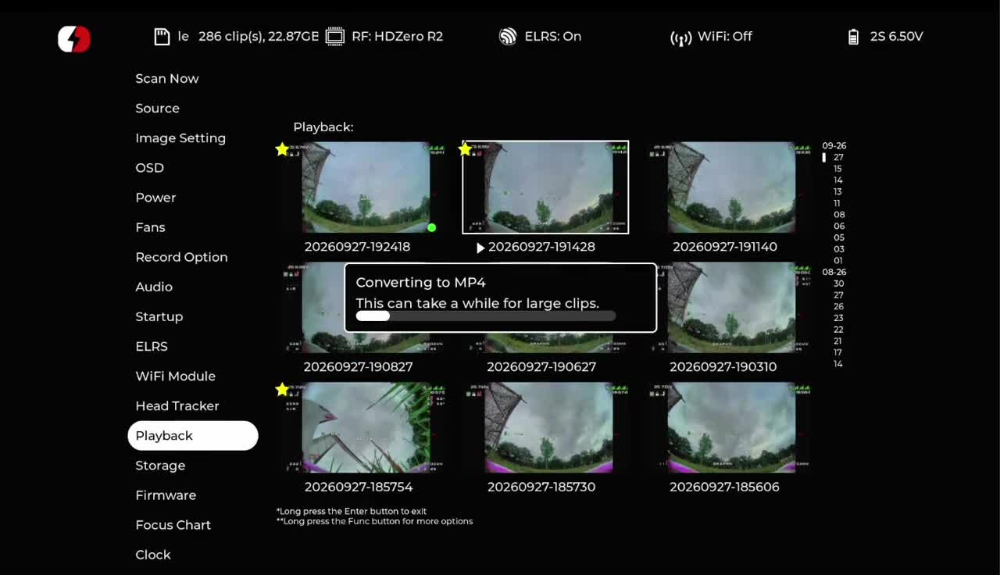](docs/videos/playback-demo.mp4)

*Click the picture to watch the demo (mp4, 3 min 47).*

### Tools

One "Tools" page groups small utilities that used to be separate menu entries or didn't exist:

- **WiFi Share** (first row): starts a WiFi hotspot and a web portal to browse, watch and download the
  DVR clips from a phone (see [WiFi Share and web portal](#wifi-share-and-web-portal)).
- **Focus Chart**: fullscreen focus test pattern. Click again to dismiss.
- **Frequency Chart**: fullscreen reference of the 5.8 GHz band plans on a linear frequency axis: the
  analog bands A, B, E, F/I and R, and the digital D, J, O and Q plans of the Walksnail / DJI systems. Each
  channel is drawn at its centre frequency with its real bandwidth, and the HDZero channels are outlined in
  white. It is an original drawing generated by `utilities/gen_freq_chart.py`. Click again to dismiss.
- **RSSI Scanner** (Goggle 2 and Box Pro only): sweeps the built-in analog receiver and plots the RF energy
  per frequency, so activity shows up even when nothing is a valid HDZero signal. Linear frequency axis,
  mV scale that auto-ranges from a 640-1200 mV base and widens when a reading falls outside it, and
  coloured A / B / E / F / R / L channel markers under the axis. Click to close.
  - **RSSI Scan Width**: Full, Lowband or Standard (E1-E8).
  - **RSSI Scan Step**: Channels (one point per channel), Coarse 4 MHz or Fine 2 MHz. 2 MHz is the finest
    step the receiver's synthesizer can do.
  - The scale is relative: there is no dBm calibration in the firmware.
  - Not available on the Goggle 1, which has no built-in analog receiver.
- **Temperature**: live readout of the goggle's temperature probes (the ones behind the fan control). Top,
  left and right on the Goggle and Goggle 2, a single probe on the Box Pro.
- **Theme**: cycles the UI theme (see above). Not offered on the Box Pro.
- **< Back**, like the other pages.

[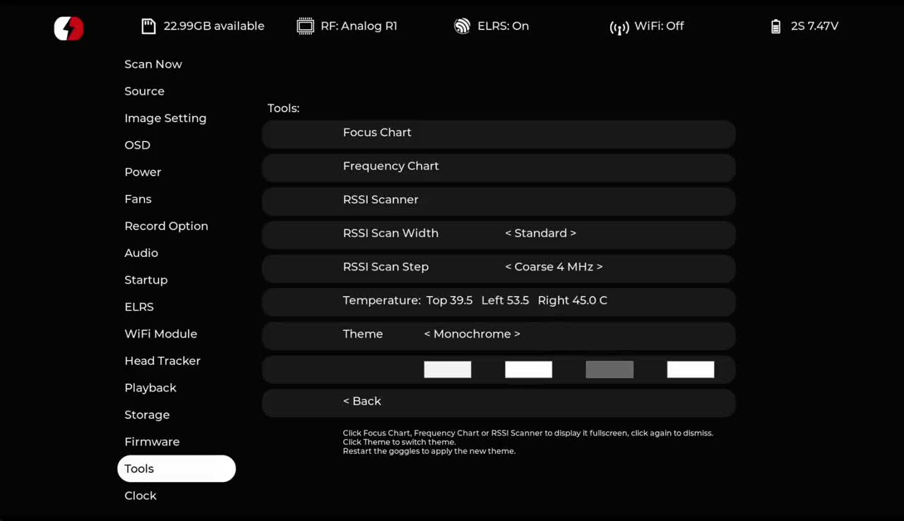](docs/videos/tools-demo.mp4)

*Click the picture to watch the demo (mp4, 2 min 12).*

### WiFi Share and web portal

The goggle can share its DVR clips over its own WiFi: pick **Tools > WiFi Share**, join the goggle's network
from a phone or a PC, and open the portal in a browser.

| Tools page | Share window |
|---|---|
| 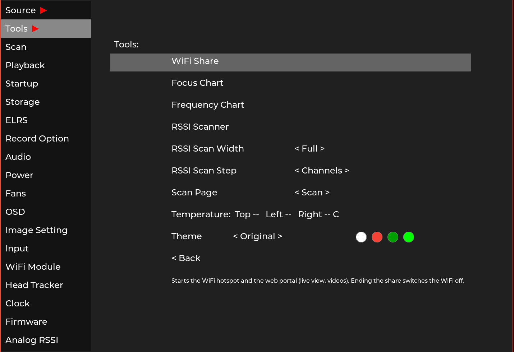 | 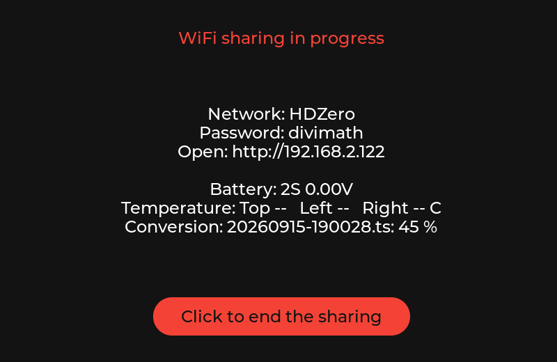 |

1. **Tools > WiFi Share**. The goggle starts its hotspot (WPA2) and the portal, and shows a window with the
   network name, the password and the address to open.
2. On the phone, join that WiFi, then open **http://192.168.2.122** (the address shown in the window; this is
   the default). There is no automatic sign-in page: the address has to be typed.
3. The window also shows the battery, the temperatures and the conversion in progress, if any.
4. Click the button in the window to end the share. Leaving the menu ends it too.

What the share does to the goggle:

- It saves power while it runs: the receivers and the DVR are switched off, the screen is dimmed and the
  fans go to their minimum (back to normal speed while a conversion runs).
- It is independent of **WiFi Module**: that page (live view over RTSP, SSH) keeps its own settings, and a
  share never changes them. When the share ends, the WiFi goes back to the state the module had before.

#### The portal

| Clips | Light copy in progress | Playing the light copy |
|---|---|---|
| 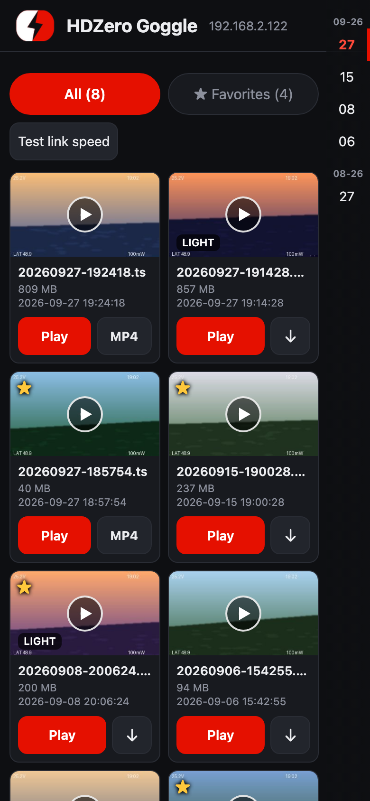 | 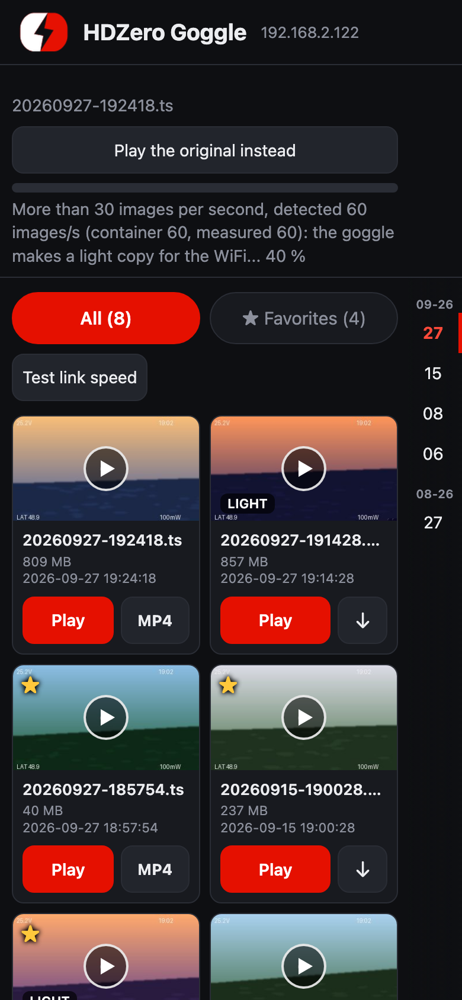 | 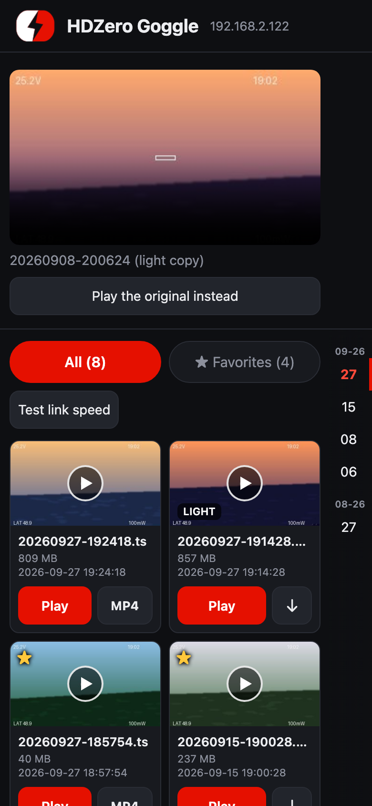 |

- The list shows a thumbnail per clip, newest first, two per row on a phone. A star marks the favourites
  (the `Favorites/` folder) and the **Favorites** button filters on them. The date strip on the right works
  like the Playback page's: tap a day to jump to it.
- **Play** plays the clip in the page. **Test link speed** measures what the WiFi really gives; the module
  is a small chip (about 18 Mbit/s), a DVR clip needs 20 to 35 Mbit/s, so a warning appears when a clip is
  too heavy to play without pauses.
- **What Play does depends on the clip:**
  - `.ts` of 30 images/s or less: converted to `.mp4` (index at the start, `hvc1` tag so that iPhones and
    Safari play it), then played. The `.ts` is deleted once the `.mp4` is checked.
  - `.ts` of more than 30 images/s: a **light copy** is made, then played.
  - `.mp4` of 30 images/s or less: played as it is.
  - `.mp4` of more than 30 images/s: a **light copy** is made, then played.
- **MP4** (on `.ts` clips) converts without playing, so that the clip can then be downloaded; the arrow
  button downloads the original file. A triple beep on the goggle ends a conversion.
- The page's header shows the firmware version and a build stamp, to check which version is served.

#### Light copies

A clip above 30 images/s (60 or 90 fps DVR) is too heavy for the WiFi. The goggle then makes a **light
copy**: its video hardware decodes the clip and encodes it again at 30 images/s or less and about 8 Mbit/s,
and the audio is copied. The progress bar and the detected frame rate (as declared by the file, and as measured
on its time stamps) are shown on the page. It takes about half of the clip's duration.

- The original is never changed. **Download** always gives the original file, and **Play the original
  instead** plays it.
- Light copies are in a `Light/` folder of the DVR folder, which the Playback page and the rolling recorder
  ignore. A clip that has one shows a **LIGHT** mark in the portal.
- A light copy that has not been watched for 3 weeks is removed. Playing one renews its date.
- **Storage > Clear Light DVR** removes all of them at once (the originals are not touched).

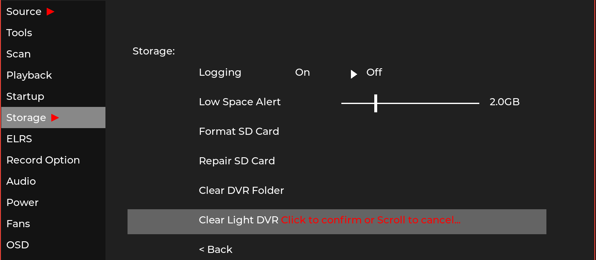

### Low SD card space alert

A configurable low-space warning (Storage page, "Low Space Alert" slider, 1.0–5.0GB in 500MB steps):

- a beep, once, the moment free space drops below the threshold,
- the status bar's free-space text turns orange,
- a "LOW SD SPACE" OSD banner while watching video — a normal OSD element, so it can be repositioned or
  hidden from OSD → Adjust OSD Elements like any other.

### SD package

Optional files that are not bundled in the firmware, to keep the app partition small. Copy the contents of
[sd-package/](sd-package/) to the root of the SD card:

- `dvr_playback_volume_test.wav`: the 10 s sample played by Audio → DVR playback test. Without it that test
  plays nothing; the other audio tests are not affected.

### Firmware update page

A failed update now shows the actual error from the on-device update script (corrupt archive, missing
component, write failure, ...) instead of a bare, uninformative "FAILED".

### UI fixes

Assorted fixes found while building the above: overlapping pills on the Power page, a missing focus outline
on the firmware-update dialog and on Clock's individual date/time fields, a stray divider line between the
sidebar and the page content, and the sidebar tab highlight landing on the wrong entry when a page is opened
programmatically (e.g. Startup="Menu" onto Source).

### Versioning

Version strings use `YY.MM.NN-graphn-<commit>` (year, month, and the number of commits so far this month —
resets on its own at the start of each month) instead of a manually bumped `X.Y.Z`. Tagged releases omit the
commit suffix.

## Environment Setup

The firmware can either be built in a [devcontainer](https://containers.dev/) or natively on a linux machine.

Note: decompressing the repository in Windows system may damage some files and prevent correct builds.

### Devcontainer Setup

This repository supports the [vscode devcontainer](https://code.visualstudio.com/docs/devcontainers/containers) integration.
To get started, install docker, vscode and the devcontainer extension.
A [prompt](https://code.visualstudio.com/docs/devcontainers/create-dev-container#_add-configuration-files-to-a-repository) to reopen this repository in a container should appear.

### Native Setup

CMake is required for generating the build files.
A bash script is supplied to take care of the bootstrap process:

```
~/hdzero-goggle$ ./setup.sh
```

## Building Firmware

In either of the above scenarios the firmware can be built via make.
An appropiate vscode build task ships with this repository as well.

Compiling HDZero Goggles:
```
~/hdzero-goggle$ cd build_goggle
~/hdzero-goggle/build_goggle$ make clean all -j $(nproc)
```

The firmware is generated as hdzero-goggle/build_goggle/out/HDZERO_GOGGLE-77-206-26.09.30-graphn-<commit>.bin
(version = year.month.this-month's-commit-count). Tagged releases omit the commit suffix.

Compiling HDZero BoxPro:
```
~/hdzero-goggle$ cd build_boxpro
~/hdzero-goggle/build_boxpro$ make clean all -j $(nproc)
```

The firmware is generated as hdzero-goggle/build_boxpro/out/HDZERO_BOXPRO-77-211-26.09.30-graphn-<commit>.bin
(version = year.month.this-month's-commit-count). Tagged releases omit the commit suffix.

### Building the firmware using nix

The nix build system can be used to build the firmware on any linux system.  
Make sure that nix [is installed](https://nixos.org/download/), and the [flakes feature](https://wiki.nixos.org/wiki/Flakes) is enabled.  
No bootstrapping or installation of any tools is required.

Use this command to build the firmware

```shellSession
nix build .#goggle-app
```

After this succeeds, the firmware can be found under `./result` in the current directory.


## Loading the Firmware

Firmware can be either flashed via goggle menu or alternatively be executed via the SD Card with a custom development script.  An example of this development script is provided below.  The goggles automatically checks to see if the develop.sh script exists in the root of the SD Card and if found develop.sh is then executed.

The following files must be placed in the root of SD Card in this example. This script will then check to see if HDZGOGGLE binary has been found during bootup and if found then executed.

Otherwise, if the HDZGOOGLE binary is not detected, the goggles will continue to load the built-in executable which was previously flashed.

SD Card File Hierarchy:

```
/develop.sh
/HDZGOGGLE
```

Development script (develop.sh):

```
#!/bin/sh

# Load via SD Card if found
if [ -e /mnt/extsd/HDZGOGGLE ]; then
	/mnt/extsd/HDZGOGGLE &
else
	/mnt/app/app/HDZGOGGLE &
fi
```

### Emergency recovery with a PhoenixCard SD card

If the goggle no longer boots, or a flash left it unusable, it can be recovered with a bootable SD card made
with the **PhoenixCard** app. This is HDZero's official procedure ("Goggle Emergency Firmware Update Process
using Phoenix App", for all versions); the original page, with the figures it refers to, is
[here](https://docs.hd-zero.com/goggles-firmware-update#goggle-emergency-firmware-update-process-using-phoenix-app-for-all-versions).

You need:

- a Windows machine
- `PhoenixCard.zip`, from the HDZero download site
- the latest firmware package from the HDZero download site (it contains `HDZGOGGLE_RX.bin` and
  `HDZGOGGLE_VA.bin`)
- an SD card

Steps:

1. Extract `PhoenixCard.zip` to a folder such as `C:\PhoenixCard`, and the firmware files to a local folder
   such as `C:\Temp`. Launch `C:\PhoenixCard\PhoenixCard.exe`.
2. Make a **bootable SD card** with PhoenixCard, following FIG.5 of the HDZero page.
3. Eject the SD card from Windows and put it in the goggle.
4. Unplug every cable (HDMI in/out, line in/out, AV in) and keep only the power cable. Power the goggle on:
   a long beep comes immediately, and another one after about 3 minutes.
5. After the second beep, power the goggle off and take the SD card out. Do not power the goggle on again
   with it inside.
6. **Restore the SD card from BOOT mode**, following FIG.6 of the HDZero page, then format it as FAT32 on
   Windows.
7. Copy `HDZGOGGLE_RX.bin` and `HDZGOGGLE_VA.bin` to the root of the SD card.
8. Put the card back in the goggle, power it on and wait about 2 minutes for a long beep.
9. Optionally, take the card out and check that the two files are gone: that confirms the flash.
10. Power the goggle off, then on.

> **Warning:** a bootable SD card has a hidden partition that Windows Explorer does not show, and a normal
> format does not remove it. If step 6 is not followed exactly, **the goggle will brick every time it is
> powered on with that card inside**. Do not rush through the steps or the timings.

This restores the official firmware. To come back to this build afterwards, flash it the usual way (the
`.bin` of your device from the SD card, as in the releases).

## Building the Emulator

Goggle source code can be built natively on the host machine and used for debugging.

### Library required

Requires build-essential tools and SDL2 development libraries (libsdl2-dev for debian) to be already installed.

```
sudo apt-get install build-essential libsdl2-dev
```

### Build and Run

Emulator support for both Goggle and BoxPro is supported by setting the appropriate compilation switches.

```
~/hdzero-goggle$ mkdir build_emu
~/hdzero-goggle$ cd build_emu
~/hdzero-goggle/build_emu$ cmake .. -DEMULATOR_BUILD=ON -DCMAKE_BUILD_TYPE=Debug -DHDZ_GOGGLE=ON -DHDZ_BOXPRO=OFF -DHDZ_GOGGLE2=OFF
~/hdzero-goggle/build_emu$ make -j $(nproc)
~/hdzero-goggle/build_emu$ ./HDZGOGGLE
```

Alternatively, `.devcontainer/emu.sh` wraps the same build inside the devcontainer image and can also grab a
headless screenshot (`emu.sh shot <name>`) without a display attached.

### Emulator Keys

`w` = wheel up
`s` = wheel down
`d` = wheel center press
`l` = right/function button
Use `F11` to toggle full screen where applicable.
